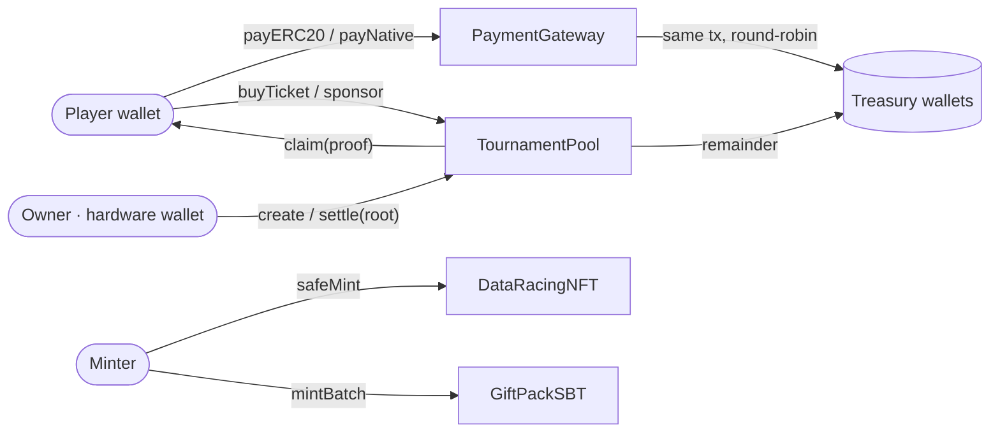
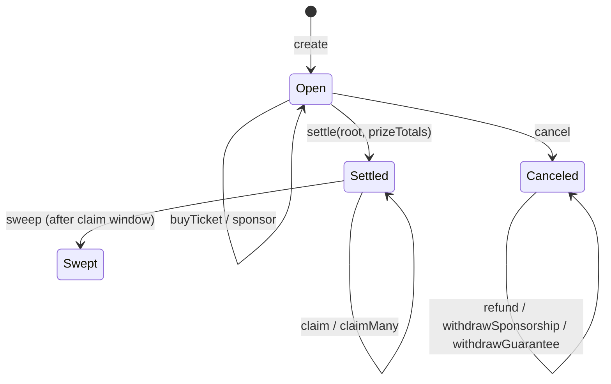

<div align="center">

# 🏁 Data Racing — Smart Contracts

**On-chain layer of [Data Racing](https://dataracing.club): a 2D racing game whose tracks are generated from real market price charts.**
A pump becomes a ramp, a wick-down becomes a pit, a dump becomes a chasm.


</div>

---

## Contracts

| Contract | Standard | Purpose |
|---|---|---|
| [`PaymentGateway`](src/PaymentGateway.sol) | — | Stateless payment forwarder for in-game purchases. Funds never rest in the contract. |
| [`TournamentPool`](src/TournamentPool.sol) | — | Escrow for paid tournaments: tickets, sponsorships, Merkle prize claims, refunds. |
| [`DataRacingNFT`](src/DataRacingNFT.sol) | ERC-721 · ERC-2981 · ERC-4906 | Bikes from the in-game store, with royalties and metadata refresh. |
| [`GiftPackSBT`](src/GiftPackSBT.sol) | ERC-721 · ERC-5192 · ERC-4906 | Soulbound gift packs for onboarding campaigns. |



---

## 💳 PaymentGateway

Pays for store items in USDG or ETH and forwards the funds to a treasury **in the same transaction**.

| Function | Caller | Effect |
|---|---|---|
| `payERC20(requestId, token, amount)` | player | pulls the exact amount to the next treasury, emits `Paid` |
| `payNative(requestId)` | player | forwards `msg.value` to the next treasury, emits `Paid` |
| `setSupported` / `setTreasuryList` / `addTreasury` / `removeTreasury` | owner | token whitelist and treasury list |
| `sweep(token, recipient)` | owner | recovers dust sent by mistake to a current treasury |
| `setSanctionsOracle(addr)` | owner | optional OFAC check (Chainalysis `isSanctioned`); `address(0)` disables it |

- **Zero custody** — invariant: `gateway.balance == 0` after any call sequence.
- **Round-robin treasuries** — every payment goes to the next wallet in the list; no backend decision per payment.
- **Opaque `requestId`** — the only link to the off-chain order. No PII on-chain.

## 🏆 TournamentPool

One escrow per chain. Each tournament is a `bytes32 id` with 1–3 token legs (e.g. USDG + ETH).



| Phase | Function | Rule |
|---|---|---|
| Create | `create(id, tokens, ticketPrices, poolBps, guaranteed, regCloseAt, settleBy)` | 1–3 allowlisted tokens; `poolBps` ∈ [25%, 100%]; guarantee is funded up-front |
| Enter | `buyTicket(id, token)` | one ticket per wallet, before `regCloseAt`, optional sanctions check |
| Boost | `sponsor(id, token, amount)` | anyone can top up the prize fund; refundable on cancel |
| Settle | `settle(id, root, prizeTotals)` | `fund = max(guaranteed, revenue × poolBps) + sponsored`; prizes can never exceed it; the remainder goes to treasury |
| Claim | `claim` / `claimMany` | Merkle proof, leaf `keccak256(keccak256(abi.encode(index, account, token, amount)))`; claim bitmap set before transfer |
| Cancel | `cancel` → `refund` | owner any time before settle; **anyone** after `settleBy + 7 days` if the owner disappears |
| Sweep | `sweep(id)` | unclaimed prizes return to the treasury after the claim window |

**Safety guarantees**

- 🔒 Claims and refunds **never pause**. `pause()` only blocks new tickets and sponsorships.
- 🧮 Fee-on-transfer tokens are rejected: every ERC-20 pull checks the balance delta (`TransferShortfall`).
- 🚪 Players can't be locked out: a stalled tournament becomes cancelable by anyone, and refunds are pull-based.
- ⛽ Batch refund pushes are gas-capped (50k per transfer), so a hostile receiver can't block the batch.

## 🏍️ DataRacingNFT

Store bikes as ERC-721. Sequential ids, batch mint (≤ 100), ERC-2981 royalties, `announceMetadataUpdate` emits ERC-4906 `MetadataUpdate` when a bike's look changes.

## 🎁 GiftPackSBT

Soulbound (ERC-5192) gift packs for the Trader Gift Pack campaign.

- `locked()` is always `true`: transfers and approvals revert `Soulbound()`.
- `mintBatch` **skips** wallets that already received a pack instead of reverting, so a re-broadcast transaction can never double-mint.
- Burning does not reset eligibility.

---

## Security model

| Concern | Control |
|---|---|
| Owner key | Hardware wallet. The backend holds no key that can move funds. |
| Ownership transfer | `Ownable2Step` — a mistyped address can't brick a contract. |
| Reentrancy | `ReentrancyGuardTransient` (EIP-1153) on every state-changing entry point. |
| Non-standard ERC-20s | `SafeERC20` everywhere. |
| Sanctions | Optional on-chain oracle, plus off-chain screening. |
| Verification | Unit, fuzz (1024 runs) and invariant tests, `forge lint`, Slither (fails on Medium+). |

## Deployments

| Network | Chain id | Contract | Address |
|---|---|---|---|
| Robinhood Chain Testnet | 46630 | PaymentGateway | [`0xaf085e846cb7c6282e6333a92b9158342da9dd1a`](https://explorer.testnet.chain.robinhood.com/address/0xaf085e846cb7c6282e6333a92b9158342da9dd1a) |
| Robinhood Chain Testnet | 46630 | TournamentPool | [`0x4a50d055e3cb9fe51746be64a667063e17c70318`](https://explorer.testnet.chain.robinhood.com/address/0x4a50d055e3cb9fe51746be64a667063e17c70318) |
| Robinhood Chain | 4663 | all | coming soon |

## Build

```sh
forge install OpenZeppelin/openzeppelin-contracts@v5.7.0 --no-git
forge build
```

## License

MIT
